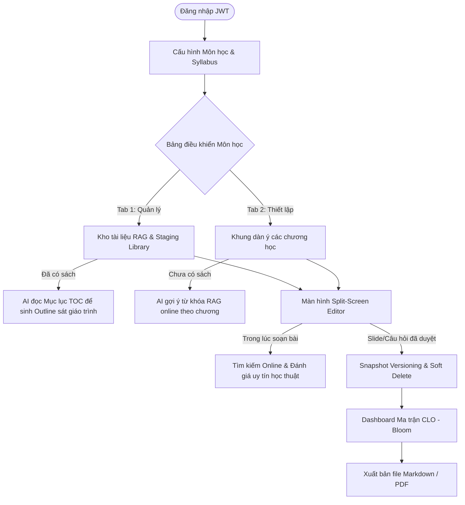

# 📄 TÀI LIỆU YÊU CẦU SẢN PHẨM (PRODUCT REQUIREMENT DOCUMENT - PRD)

## DỰ ÁN: AI TRỢ LÝ THIẾT KẾ BÀI GIẢNG & HỌC LIỆU (AI LECTURE ASSISTANT)

> **Mã đề tài:** AI20K-005  
> **Lĩnh vực:** Giáo dục Đại học (Higher Education)  
> **Tài liệu:** Product Requirement Document (PRD)  
> **Phiên bản:** MVP 1.2 (Cập nhật Hệ thống điều hướng nhanh 1-Click)

---

## 1. THÔNG TIN CHUNG & KIẾN TRÚC MÔ HÌNH LAI (HYBRID WORKFLOW)

Hệ thống **AI Lecture Assistant** giúp giảng viên giảm thời gian soạn giáo án, slide bài giảng, kịch bản sư phạm và ngân hàng câu hỏi kiểm tra đánh giá từ 3 ngày xuống dưới 30 phút, đồng thời đảm bảo tính chuẩn xác học thuật và sự liên kết (Constructive Alignment) giữa Syllabus (CLO) - Thang Bloom - Học liệu giảng dạy.

Thay vì bắt người dùng đi theo luồng tuyến tính cứng nhắc, hệ thống áp dụng kiến trúc **Bảng điều khiển môn học (Course Dashboard)** làm trung tâm, hỗ trợ luồng làm việc lai (Hybrid Workflow) tùy thuộc vào việc giảng viên đã có tài liệu riêng hay chưa.

### Sơ đồ kiến trúc & Luồng dữ liệu mới

---

## 2. PHÂN TÍCH NHÂN VẬT & USER STORIES

### 2.1. Đối tượng Người dùng chính (Target Persona)
- **Họ và tên:** TS. Nguyễn Văn A  
- **Vai trò:** Giảng viên Viện Kỹ thuật và Khoa học Máy tính tại VinUni.  
- **Đặc điểm:** Yêu cầu khắt khe về học thuật, sợ AI ảo tưởng trích dẫn. Cần tối giản các thủ tục giấy tờ kiểm định (CLO - Bloom).

### 2.2. Danh sách User Stories cốt lõi
- **US-1 (Thiết lập môn học):** Là giảng viên, tôi muốn dán text hoặc tải file Syllabus để AI tự bóc tách các CLO kèm mức Bloom, hỗ trợ form chỉnh sửa thủ công để khớp 100% tài liệu nhà trường.
- **US-2 (Lựa chọn nguồn học liệu):** Là giảng viên, tôi muốn hệ thống hoạt động linh hoạt: Nếu tôi tải lên giáo trình trước, AI sẽ đọc để gợi ý dàn ý; nếu tôi chưa có giáo trình, AI sẽ tự tạo dàn ý và gợi ý các từ khóa tìm tài liệu online phù hợp cho từng chương.
- **US-3 (Duyệt đề xuất kiểm soát):** Là giảng viên, tôi muốn soạn giáo án trên giao diện Split-Screen Editor, hiển thị nổi bật các vùng AI không chắc chắn (Confidence Highlighting), loại bỏ việc duyệt tự động hàng loạt để tôi bắt buộc phải kiểm duyệt nội dung.
- **US-4 (Đảm bảo độ tin cậy đề thi):** Là giảng viên, tôi muốn ngân hàng câu hỏi đồng cấu khi sinh ra phải chạy qua bộ tự giải (Self-Correction) và bộ thẩm định chéo mức Bloom (Bloom Auditor Agent) để tránh sai sót trước khi tôi duyệt và cam kết lời giải.
- **US-5 (Điều hướng nhanh 1-Click):** Là giảng viên, tôi muốn có thể nhảy nhanh về trang chủ, về bảng điều khiển môn học hoặc sang trang ma trận kiểm định CLO từ bất cứ đâu bằng 1 click chuột mà không cần phải nhấn nút Back liên tục.

---

## 3. YÊU CẦU CHỨC NĂNG CHI TIẾT (FUNCTIONAL REQUIREMENTS)

### FR-01: Đăng nhập & Phân quyền (Authentication & Authorization)
- **Mô tả:** Cho phép người dùng đăng ký, đăng nhập tài khoản bằng Email/Password, cấp mã JWT token.
- **Phân quyền:** Dữ liệu môn học, CLO, chương học, tài liệu nguồn RAG và câu hỏi được cô lập tuyệt đối theo tài khoản giảng viên (`user_id`). Không cho phép truy cập chéo dữ liệu giữa các giảng viên.

### FR-02: Trích xuất Syllabus & Quản lý CLO
- **Mô tả:** Hệ thống hỗ trợ nạp Syllabus bằng cách tải file (PDF/Docx) hoặc copy-paste text thô. Trích xuất Mã môn, Tên môn, Danh sách CLO, Mô tả và mức Bloom đề xuất (1-6).
- **Form Edit:** Giảng viên có quyền thêm, sửa, xóa các CLO ngay trên giao diện trước khi lưu vào SQLite.

### FR-03: Kho tài liệu nguồn lai & Multi-tenant RAG (Library)
- **Mô tả:** Quản lý tài liệu nguồn của môn học thông qua Vector DB ChromaDB với metadata filter cứng `user_id` và `course_id`.
- **Cơ chế bóc tách hai giai đoạn (Two-stage Outline Generation):**
  * *Pha 1:* Khi tải tài liệu lớn (sách giáo trình), backend chỉ bóc tách phần **Mục lục (Table of Contents - TOC)** và vài trang giới thiệu đầu chương để lưu cấu trúc (`document_structure`).
  * *Pha 2:* AI chỉ sử dụng cấu trúc Mục lục này + Syllabus để đề xuất Khung Outline chương học nhằm tránh tràn giới hạn context và giảm chi phí API.
- **Kho đệm tài liệu online (Staging Library):**
  * Kết quả tìm kiếm tài liệu từ Web Search/arXiv không được nạp tự động vào Vector DB chính.
  * Tài liệu online được đưa vào Kho đệm. Giảng viên xem điểm uy tín học thuật và bấm `[Nạp vào kho]` thì backend mới phân mảnh đưa vào ChromaDB môn học để tránh làm loãng/nhiễu dữ liệu.
- **Tuân thủ bản quyền (Copyright Compliance Filter):**
  * Hệ thống lọc và từ chối tải/cào nội dung các trang web thương mại trả phí.
  * Chỉ scrape nội dung từ các trang Open Access hoặc bóc tách phần Tóm tắt (Abstract) đối với các bài báo có bản quyền để đảm bảo tuân thủ bản quyền.
- **Bóc tách đa phương tiện (Multi-modal Visual Ingestion):**
  * Sử dụng mô hình thị giác (Visual Language Model - VLM) để đọc tài liệu PDF. 
  * Khi phát hiện hình ảnh sơ đồ/biểu đồ, VLM tự động sinh văn bản mô tả (Image Captioning - ví dụ: *"Sơ đồ cây BST có nút gốc 15, nhánh trái 10..."*) và nhúng mô tả này vào Vector DB bên cạnh chunk text để AI hiểu cấu trúc hình ảnh khi sinh slide.

### FR-04: Outline Generator & Skeletal Design (Bảng điều khiển môn học)
- **Mô tả:** Bảng điều khiển tích hợp **Smart Guide Banner** đưa ra hướng dẫn theo trạng thái dữ liệu (Ví dụ: đề xuất sinh Outline nếu chưa có chương học; đề xuất từ khóa tìm RAG online cho từng chương nếu chưa có tài liệu).
- **Tương tác:** Cho phép kéo thả (Drag-and-Drop) sắp xếp thứ tự, thêm hoặc xóa chương.

### FR-05: AI Material Generator & Split-Screen Editor (Human-in-the-loop)
- **Mô tả:** Sinh slide bài giảng (Markdown) và kịch bản Active Learning.
- **Split-Screen Editor:**
  * *Bên trái:* Đề xuất của AI. Mọi đoạn văn RAG bắt buộc hiển thị nhãn trích dẫn `[Tài liệu A - Trang 12] 🔍`. Hover chuột hiển thị popover thông tin chi tiết (raw chunk, similarity). 
  * *Bên phải:* Khung Rich Editor của giảng viên để duyệt và tinh chỉnh tự do.
- **Cơ chế giảm tải duyệt mù (Friction UX & Confidence Highlighting):**
  * Loại bỏ nút "Duyệt tất cả" hàng loạt. Giảng viên bắt buộc phải duyệt từng khối.
  * Đánh dấu các vùng thông tin AI không chắc chắn bằng màu sắc nổi bật (Ví dụ: viền đỏ nếu similarity RAG < 80% hoặc Web Search có độ tin cậy vàng cam).

### FR-06: Ngân hàng câu hỏi & Bloom Auditor Agent
- **Mô tả:** Sinh câu hỏi trắc nghiệm gán tag Bloom và CLO ID. Hỗ trợ sinh câu hỏi đồng cấu.
- **Quy trình thẩm định 3 pha:**
  * *Pha 1 (Generator):* LLM sinh câu hỏi, các đáp án và lời giải chi tiết.
  * *Pha 2 (Solver):* LLM đóng vai sinh viên tự giải độc lập và đối chiếu đáp án để tự sửa lỗi logic/toán học (Self-Correction).
  * *Pha 3 (Auditor):* Một Agent độc lập đọc câu hỏi để phân loại mức Bloom. Nếu mức Bloom đánh giá lệch với CLO yêu cầu, hệ thống yêu cầu Generator sinh lại.
- **Monaco Editor Preview:** Đối với câu hỏi lập trình, hiển thị code qua editor Monaco thu nhỏ để giữ nguyên tab/thụt dòng thụ động và hỗ trợ syntax highlighting.
- **Cam kết lời giải (Friction Gate):** Yêu cầu giảng viên tích chọn hộp thoại cam kết kiểm tra thủ công trước khi lưu vào ngân hàng câu hỏi.

### FR-07: Tìm kiếm Web & Đánh giá Độ uy tín (Academic Credibility Evaluator)
- **Mô tả:** Khi không có tài liệu nguồn RAG (hoặc giảng viên có nhu cầu tìm thêm), hệ thống kích hoạt Web Search (Tavily/arXiv) để thu thập dữ liệu mạng.
- **Chấm điểm uy tín (0.0 - 1.0):** Domain học thuật (+0.5), mã DOI (+0.2), sự đồng thuận học thuật (+0.15), thời gian xuất bản trong 5 năm (+0.15).
- **Màu sắc hiển thị:** Xanh lá (>=80% - Uy tín), Vàng cam (70%-79% - Cần đọc lướt), Đỏ (<70% - Bỏ qua).

### FR-08: Thống kê, Nhất quán dữ liệu & Xuất bản
- **Mô tả:** Dashboard hiển thị biểu đồ phân bổ ma trận CLO - Bloom của ngân hàng câu hỏi. Hỗ trợ xuất file Markdown/PDF.
- **Nhất quán dữ liệu & Phiên bản (Version Snapshot):**
  * *Soft Delete Warning:* Khi giảng viên xóa tài liệu nguồn, hệ thống quét SQLite. Nếu tài liệu đang được trích dẫn ở slide/câu hỏi nào, hiển thị cảnh báo từ chối hoặc cảnh báo trước khi xóa.
  * *Snapshot Version Locking:* Slide/câu hỏi đã duyệt sẽ lưu kèm bản snapshot của đoạn văn bản thô (raw chunk) được trích dẫn. Dù tài liệu gốc bị sửa/xóa, nội dung bài giảng đã phê duyệt và chứng cứ kiểm định (audit trail) vẫn được giữ nguyên.

### FR-09: Hệ thống điều hướng phi tuyến tính (Shortcut Navigation)
- **Mô tả:** Tích hợp thanh Global Navigation Header và Breadcrumbs ở đầu tất cả các màn hình làm việc.
- **Chức năng:** 
  * Cho phép giảng viên nhấp vào Logo để về Trang chủ, nhấp vào Tên môn để về Course Dashboard, hoặc nhấp vào nút Ma trận CLO-Bloom để đi thẳng tới trang kiểm định từ bất kỳ vị trí nào chỉ với 1 click.
  * Tự động hiển thị hộp thoại xác nhận lưu thay đổi nếu giảng viên click chuyển trang khi có bài soạn chưa lưu.

---

## 4. YÊU CẦU PHI CHỨC NĂNG (NON-FUNCTIONAL REQUIREMENTS)

| Mã số | Nhóm yêu cầu | Đặc tả chi tiết |
|---|---|---|
| **NFR-01** | **Bảo mật & Cô lập dữ liệu** | 100% dữ liệu vector và quan hệ của giảng viên phải được lọc theo `user_id` ở mức truy vấn DB. Không cho phép rò rỉ dữ liệu giữa các tài khoản. |
| **NFR-02** | **Độ trễ & Phản hồi** | Thời gian phản hồi sinh câu hỏi/slide không quá 30 giây. Sử dụng UI Loading Spinner sinh động trong lúc xử lý tác vụ nền. |
| **NFR-03** | **Quản lý Chi phí API** | Khống chế chi phí token trung bình cho mỗi lần sinh 1 chương dưới **0.5 USD**. Áp dụng cache kết quả với các truy vấn tương tự và cơ chế bóc tách hai giai đoạn (TOC). |
| **NFR-04** | **Tính ổn định (Resilience)** | Hệ thống không được crash màn hình trắng khi API bên thứ ba gặp lỗi kết nối hoặc rate limit. Chuyển sang chế độ Fallback và thông báo rõ ràng cho người dùng. |
| **NFR-05** | **Tự động lưu & Khôi phục** | Tự động lưu bản nháp của Rich Editor xuống Local Storage chu kỳ 5 giây/lần. Hiển thị trạng thái đồng bộ rõ ràng. |
| **NFR-06** | **Chính sách Quyền riêng tư** | Cung cấp tùy chọn Bật/Tắt thu thập dữ liệu hành vi (Opt-in/Opt-out Telemetry). Chỉ gửi thông số số học (Edit distance) về server, tuyệt đối không gửi nội dung chữ giảng viên gõ. |
| **NFR-07** | **Tuân thủ URL Bản quyền** | Tự động bỏ qua và cảnh báo nếu người dùng nhập URL thuộc các trang khóa tính phí thương mại (Paywall domains). |

---

## 5. MA TRẬN QUẢN TRỊ RỦI RO & PHƯƠNG ÁN XỬ LÝ (FAILURES & UX MITIGATIONS)

| STT | Tình huống kích hoạt (Trigger) | Lỗi hệ thống có thể xảy ra (Failure) | Hậu quả (Impact) | Giải pháp khắc phục (UX Mitigation / Fallback) |
|---|---|---|---|---|
| **1** | GV upload file Syllabus dạng scan bị lỗi font hoặc bảng biểu phức tạp. | Parser không trích xuất được text, LLM nhận diện sai hoặc thiếu các chuẩn CLO. | Làm nghẽn toàn bộ quy trình thiết lập môn học phía sau. | Cung cấp Textarea để copy-paste text thô trực tiếp. Cho phép giảng viên tự thêm/sửa/xóa CLO bằng Form chỉnh sửa trên UI. |
| **2** | GV thực hiện RAG query để sinh nội dung slide bài giảng. | LLM bị hiện tượng ảo tưởng trích dẫn (Fake Citation), bịa ra số trang không tồn tại. | Làm mất uy tín học thuật của giảng viên trước sinh viên và hội đồng. | **Strict Metadata Mapping:** Gán cứng số trang vật lý thật vào metadata của Chunk khi nạp tài liệu. Ép LLM trả về cấu trúc JSON chứa chunk_id để backend đối chiếu số trang thật từ DB và hiển thị trên popover. |
| **3** | RAG truy xuất được 2 nguồn uy tín nhưng nội dung khoa học mâu thuẫn trực tiếp. | LLM tự động "trung hòa" thành một kiến thức thứ ba bịa đặt (ảo tưởng logic). | Học liệu đầu ra bị hỗn loạn thông tin khoa học. | Sử dụng Reranker phát hiện sự khác biệt lớn. Prompt ép LLM không được trộn lẫn mà phải hiển thị rõ 2 tùy chọn học thuyết mâu thuẫn kèm cảnh báo trên UI. |
| **4** | Hệ thống cần giải bài toán Multi-Hop Retrieval (ví dụ: Sơ đồ ở chương 2 và Bảng số liệu ở phụ lục). | RAG thông thường chỉ lấy các đoạn rời rạc, làm đứt gãy chuỗi suy luận (Reasoning Path). | AI sinh bài tập lớn bị sai lệch logic và thiếu thông tin bổ trợ. | **VLM Parser:** Sử dụng mô hình Visual Language Model (VLM) để chuyển đổi sơ đồ/bảng biểu thành định dạng Markdown thô ngay từ khi tải lên, sau đó lưu trữ RAG văn bản kèm liên kết chéo. |
| **5** | GV yêu cầu sinh hoạt động Active Learning cho lớp học. | AI đề xuất kịch bản phi thực tế (ví dụ: thảo luận nhóm 20 phút cho giảng đường lớn 100 sinh viên bàn cố định). | Bài giảng của giảng viên bị phá sản khi lên lớp thực tế. | Ép giảng viên chọn sĩ số lớp học và cơ sở vật chất qua giao diện trước khi sinh. Sử dụng các tham số này làm ràng buộc hệ thống cứng (System Prompt constraints). |
| **6** | GV bấm nút sinh bộ câu hỏi Bloom hoặc slide bài giảng. | API bên thứ ba bị timeout (>30s) hoặc rate limit. | Hệ thống treo, giao diện bị crash trắng hoặc báo lỗi lập trình khó hiểu. | Hiển thị màn hình Loading động, cho phép chạy ngầm (polling). Nếu lỗi, hiển thị popup thông báo thân thiện và tự động phục hồi bản soạn thảo gần nhất từ Local Storage. |

---

## 6. HỆ THỐNG KPI ĐO LƯỜNG THỰC TẾ

1. **Chỉ số Năng suất (Productivity KPI):**
   - *Định nghĩa:* Thời gian hoàn thành 1 slide chương kèm 5 câu hỏi kiểm tra đã phê duyệt.
   - *Target:* **Dưới 30 phút** (giảm từ 3 ngày làm việc theo cách truyền thống).
2. **Chỉ số Chất lượng & Bảo mật (Quality KPI):**
   - *Hallucination Rate:* Tỷ lệ thông tin trích dẫn bịa đặt đạt **0%** nhờ cơ chế khóa vùng dữ liệu RAG.
   - *Security Leakage:* Tỷ lệ rò rỉ thông tin chéo giữa các tài khoản giảng viên đạt **0%**.
3. **Chỉ số Hài lòng (Adoption KPI):**
   - *Syllabus & Content Acceptance Rate:* Tỷ lệ số từ/nội dung do AI sinh ra được giảng viên giữ lại (không bị xóa viết lại hoàn toàn) đạt **> 70%**.
4. **Chỉ số Trải nghiệm & Chi phí (Usability & Cost KPI):**
   - *Edit-Click Count:* Số click trung bình để chỉnh sửa xong một khối nội dung **dưới 3 click** nhờ giao diện Split-Screen Editor và kéo thả trực quan.
   - *API Token Cost:* Chi phí token trung bình **< 0.5 USD/chương**.
