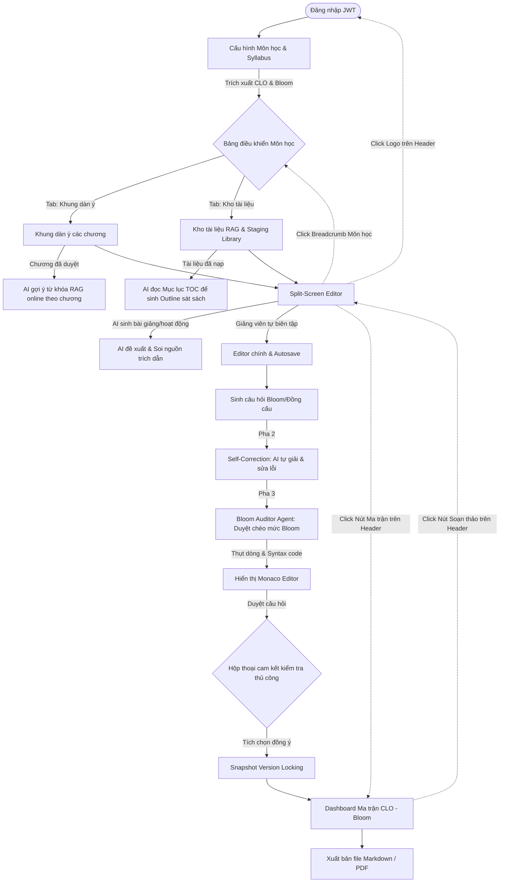

# 🎨 ĐẶC TẢ UI/UX, LUỒNG NGƯỜI DÙNG & MOCKUP CHI TIẾT (UI FLOW & WIREFRAMES)

## DỰ ÁN: AI TRỢ LÝ THIẾT KẾ BÀI GIẢNG & HỌC LIỆU (AI LECTURE ASSISTANT)

> **Mã đề tài:** AI20K-005  
> **Tài liệu:** UI Flow & Wireframe Specification  
> **Phiên bản:** MVP 1.2 (Cập nhật Hệ thống điều hướng nhanh 1-Click)

---

## 1. SƠ ĐỒ LUỒNG NGƯỜI DÙNG LINH HOẠT (HYBRID USER FLOW MAP)

Dưới đây là luồng trải nghiệm phi tuyến tính của giảng viên, lấy **Bảng điều khiển môn học (Course Dashboard)** làm trung tâm và hỗ trợ **Hệ thống điều hướng nhanh (Shortcut Navigation Header)**:



---

## 2. PHẠM VI GIAO DIỆN & ASCII WIREFRAMES

### Màn hình 1: Course Dashboard với Smart Guide Banner
Đây là trung tâm điều hướng của môn học. Dashboard hiển thị 2 Tab song song kèm **Smart Guide Banner** và **Thanh điều hướng toàn cục (Global Header)**.

```
+--------------------------------------------------------------------------------------------------+
| [🏠 AI Lecture Assistant] > Cấu trúc dữ liệu & Giải thuật        [📊 Ma trận CLO-Bloom] [Đăng xuất] |
+--------------------------------------------------------------------------------------------------+
| BẢNG ĐIỀU KHIỂN MÔN HỌC (COURSE DASHBOARD)                                                       |
|                                                                                                  |
|  🔔 GỢI Ý HỆ THỐNG:                                                                              |
|  +--------------------------------------------------------------------------------------------+ |
|  | 👉 Bạn chưa tải lên tài liệu giáo trình nào cho môn học này. Hệ thống khuyên bạn nên:      | |
|  |   1. Duyệt Khung dàn ý các chương học trước.                                               | |
|  |   2. Hệ thống sẽ tự động đề xuất từ khóa tìm kiếm tài liệu online cho từng chương.         | |
|  +--------------------------------------------------------------------------------------------+ |
|                                                                                                  |
|  [ TAB 1: KHUNG DÀN Ý CHƯƠNG HỌC ]       [ TAB 2: KHO TÀI LIỆU NGUỒN ]                            |
|  ----------------------------------------------------------------------------------------------  |
|  * Trạng thái Khung dàn ý: 4 Chương học (Đã duyệt)                          [ Sinh lại bằng AI ] |
|  +---------------------------------------------------------------------------------------------+ |
|  | [=] Chương 1: Tổng quan về Cấu trúc dữ liệu và Đánh giá thuật toán                 [Sửa] [X] | |
|  | [=] Chương 2: Danh sách liên kết và Ngăn xếp, Hàng đợi                               [Sửa] [X] | |
|  | [=] Chương 3: Cây Tìm Kiếm Nhị Phân (BST)                                           [Sửa] [X] | |
|  | [=] Chương 4: Đồ thị và các thuật toán duyệt đồ thị                                 [Sửa] [X] | |
|  +---------------------------------------------------------------------------------------------+ |
|  [ + Thêm Chương mới ]                                                                           |
|                                                                                                  |
|                                                                        [ TIẾP TỤC SOẠN BÀI ]     |
+--------------------------------------------------------------------------------------------------+
```

---

### Màn hình 2: Kho tài liệu nguồn & Kho đệm trực tuyến (Staging Library)
*   **Thanh điều hướng nhanh:** Giảng viên có thể bấm vào `[🏠 AI Lecture Assistant]` để về danh sách môn học, hoặc bấm vào `[📚 Cấu trúc dữ liệu]` để quay lại Course Dashboard.

```
+--------------------------------------------------------------------------------------------------+
| [🏠 AI Lecture Assistant] > [📚 Cấu trúc dữ liệu] > Kho tài liệu  [📊 Ma trận CLO-Bloom] [Đăng xuất] |
+--------------------------------------------------------------------------------------------------+
| KHO TÀI LIỆU NGUỒN & KHO ĐỆM TRỰC TUYẾN                                                          |
|                                                                                                  |
|  1. KHO TÀI LIỆU NỘI BỘ (Chắc chắn đưa vào RAG)                                                  |
|  +---------------------------------------+-----------------------------+-----------------------+ |
|  | Tên File tài liệu                     | Số trang bóc tách (TOC)     | Trạng thái            | |
|  +---------------------------------------+-----------------------------+-----------------------+ |
|  | 📄 Giao_trinh_BST_Ver2.pdf            | 45 trang (Bóc tách TOC)     | [ Đã lưu vào DB ] [X] | |
|  +---------------------------------------+-----------------------------+-----------------------+ |
|  [ + Tải lên tài liệu giáo trình (.pdf, .txt) ]                                                  |
|                                                                                                  |
|  2. KHO ĐỆM ĐỀ XUẤT TÀI LIỆU ONLINE (Dựa trên Chương học đã duyệt)                               |
|  +---------------------------------------------------------------------------------------------+ |
|  | Chương 3: Cây Tìm Kiếm Nhị Phân (BST)                                                       | |
|  |   🌐 [Tavily Web Search] Keyword: "Binary search tree tutorial"                              | |
|  |   - Title: "Introduction to BST - GeeksforGeeks" (Độ uy tín: 85% - Xanh lá)                  | |
|  |     [ Xem tóm tắt ]   [ + Nạp vào kho môn học ]   [ Bỏ qua ]                                    | |
|  |   - Title: "BST visualizer and theory" (Độ uy tín: 68% - Đỏ)                                  | |
|  |     [ Xem tóm tắt ]   [ + Nạp vào kho môn học ]   [ Bỏ qua ]                                    | |
|  |                                                                                             | |
|  |   🎓 [arXiv Papers] Keyword: "Optimized Binary Search Tree indexing"                            | |
|  |   - Title: "A Study on Dynamic BST algorithms" (Độ uy tín: 95% - Xanh lá)                    | |
|  |     DOI: 10.1109/BST.2024.123456 | Open Access: Có                                          | |
|  |     [ Xem tóm tắt ]   [ + Nạp vào kho môn học ]   [ Bỏ qua ]                                    | |
|  +---------------------------------------------------------------------------------------------+ |
|                                                                                                  |
|                                                                           [ ĐI TỚI SOẠN BÀI GIẢNG ]|
+--------------------------------------------------------------------------------------------------+
```

---

### Màn hình 3: Split-Screen Editor với Confidence Highlighting
Giảng viên có thể bấm nhanh vào `[📊 Ma trận CLO-Bloom]` để xem tình trạng phủ câu hỏi của môn học mà không bị mất bản nháp (do đã tự động lưu nháp).

```
+--------------------------------------------------------------------------------------------------+
| [🏠 AI Lecture Assistant] > [📚 Cấu trúc dữ liệu] > Soạn thảo C3  [📊 Ma trận CLO-Bloom] [Đăng xuất] |
+--------------------------------------------------------------------------------------------------+
| [<< Đóng đề xuất] BÊN TRÁI: AI ĐỀ XUẤT (Markdown)  | BÊN PHẢI: KHUNG BIÊN TẬP CỦA GIẢNG VIÊN      |
+----------------------------------------------------+---------------------------------------------+
| 📂 AI sinh Slide (RAG Nội bộ)                      | # Chương 3: Cây Tìm Kiếm Nhị Phân           |
|                                                    |                                             |
| # Slide 1: Khái niệm Cây BST                       | Cây nhị phân tìm kiếm (Binary Search Tree)   |
| * Cây nhị phân có tính chất sắp xếp thứ tự.        | là một cấu trúc dữ liệu cực kỳ quan trọng...|
|   Nhánh trái < Gốc < Nhánh phải.                   |                                             |
|   [Tài liệu A - Trang 12] 🔍                       | |                                           |
|                                                    | (Vị trí con trỏ chuột soạn thảo)            |
|   [Chèn vào Slide >>]   [Bỏ qua]                   |                                             |
| -------------------------------------------------- |                                             |
| ! CẢNH BÁO RAG ĐỘ TƯƠNG ĐỒNG THẤP (<80%)            |                                             |
| +------------------------------------------------+ |                                             |
| | Slide 2: Xóa phần tử trên cây BST              | |                                             |
| | * Khi xóa nút có 2 con, ta thay bằng phần tử   | |                                             |
| |   thế mạng là nút phải nhất của cây con trái.  | |                                             |
| |   [Chèn vào Slide >>]   [Bỏ qua]               | |                                             |
| +------------------------------------------------+ |                                             |
| -------------------------------------------------- |                                             |
| 📝 Hoạt động Active Learning (Ghế: Cố định)        |                                             |
| * Hoạt động thảo luận nhóm vẽ BST (5 phút).        |                                             |
|   [Chèn vào Kịch bản >>]   [Bỏ qua]                |                                             |
+----------------------------------------------------+---------------------------------------------+
| 📶 Đã đồng bộ lên Cloud  | 📊 API: Sẵn sàng | Trễ: 1.2s | Chi phí: $0.04 | [Xem Traces Langfuse]   |
|                                                    |                 [ LƯU NHÁP ]  [ XUẤT BẢN ]  |
+--------------------------------------------------------------------------------------------------+
```

---

### Màn hình 4: Compliance & Matrix Dashboard (Cây Ma trận)
*   **Thanh điều hướng nhanh:** Nút `[📝 Quay lại soạn thảo]` đưa giảng viên quay lại ngay màn hình soạn thảo chương học gần nhất đang bỏ dở.

```
+--------------------------------------------------------------------------------------------------+
| [🏠 AI Lecture Assistant] > [📚 Cấu trúc dữ liệu] > Ma trận phủ   [📝 Quay lại soạn thảo] [Đăng xuất] |
+--------------------------------------------------------------------------------------------------+
| DASHBOARD KIỂM ĐỊNH ĐẢM BẢO CHẤT LƯỢNG (CLO vs Bloom Matrix)                                     |
|                                                                                                  |
|  Tổng số câu hỏi: 25   |  Số CLO đã phủ: 4/5 (80%)  |  Mức Bloom cao nhất: Phân tích (B4)              |
|                                                                                                  |
|  MA TRẬN ĐỘ PHỦ CÂU HỎI THEO CHUẨN ĐẦU RA MÔN HỌC                                                 |
|                                                                                                  |
|  CLO Code   | Nhớ (B1)   | Hiểu (B2)   | Vận dụng (B3)| Phân tích (B4)| Tổng số câu hỏi         |
|  -----------+------------+-------------+--------------+---------------+-------------------------|
|  CLO1       | [██] 2     | [████] 4    | [ ] 0        | [ ] 0         | 6 câu                   |
|  CLO2       | [ ] 0      | [██] 2      | [██████] 6   | [ ] 0         | 8 câu                   |
|  CLO3       | [ ] 0      | [ ] 0       | [██] 2       | [████] 4      | 6 câu                   |
|  CLO4       | [██] 2     | [██] 2      | [██] 2       | [ ] 0         | 5 câu                   |
|  CLO5 (Mới) | [ ] 0      | [ ] 0       | [ ] 0        | [ ] 0         | ⚠️ 0 câu (Chưa phủ)     |
|                                                                                                  |
|  [!] ĐỀ XUẤT HỆ THỐNG: CLO5 (Thiết kế hệ thống BST tối ưu) hiện chưa có câu hỏi kiểm tra nào.    |
|  [Bấm vào đây để AI sinh tự động câu hỏi cho CLO5 ở mức Bloom 4]                                 |
|                                                                                                  |
|                                                            [ XUẤT BÁO CÁO MA TRẬN PDF / EXCEL ]  |
+--------------------------------------------------------------------------------------------------+
```

---

## 3. ĐẶC TẢ TƯƠNG TÁC CHI TIẾT (MICRO-INTERACTIONS)

### 3.1. Hệ thống điều hướng phi tuyến tính (Shortcut Navigation)
*   **Trang chủ (Logo):** Bấm vào biểu tượng ngôi nhà `[🏠 AI Lecture Assistant]` sẽ đưa giảng viên về danh sách môn học chính. Hệ thống hiển thị popup xác nhận nếu có thay đổi chưa lưu trên server.
*   **Breadcrumbs:** Hiển thị dưới dạng `[🏠 AI Lecture Assistant] > [📚 Tên môn học] > [Tên màn hình hiện tại]`. Các mục nằm trong dấu ngoặc `[...]` đều là liên kết có thể bấm được để quay về cấp độ đó ngay lập tức.
*   **Nút chuyển đổi trạng thái:** Nút `[📊 Ma trận CLO-Bloom]` hiển thị cố định ở Header của màn hình soạn thảo giúp giảng viên chuyển nhanh sang xem tiến độ phủ câu hỏi mà không cần qua nhiều bước trung gian.

### 3.2. Quy trình sinh dàn ý 2 giai đoạn (Two-stage Outline Ingestion)
- **Tương tác:** Giảng viên tải lên file giáo trình nặng (PDF 500 trang).
- **Backend xử lý:** Hệ thống hiển thị trạng thái `[Đang trích xuất Mục lục (TOC)...]`. Sau khi bóc tách xong ~5-10 trang mục lục, hệ thống lưu trữ cấu trúc dạng JSON và báo trạng thái `[Đã nạp mục lục - Sẵn sàng sinh Outline]`.

### 3.3. Cảnh báo Nhất quán Dữ liệu (Soft Delete & Version Locking)
- **Hành động:** Giảng viên bấm nút Xóa file trong Kho tài liệu.
- **Cảnh báo:** Bật popup hiển thị danh sách các chương đang sử dụng tài liệu này làm nguồn trích dẫn trước khi đồng ý xóa.
- **Snapshot Lock:** Khi slide được lưu, backend tự động copy và lưu cứng đoạn văn bản thô (raw chunk) của trích dẫn đó để tránh hỏng liên kết.

### 3.4. Confidence Highlighting (Tô viền cảnh báo AI ảo tưởng)
- **Quy tắc hiển thị:** Đánh dấu viền đỏ cam nét đứt xung quanh khối nội dung AI sinh nếu độ tương đồng vector RAG thấp (<80%). Hover chuột hiển thị lý do cảnh báo chi tiết.

### 3.5. Bloom Auditor Agent (Kiểm định chéo mức Bloom)
- Khi AI đề xuất câu hỏi trắc nghiệm, một Agent độc lập sẽ tự động chạy ngầm để kiểm tra xem câu hỏi có đạt đúng mức Bloom yêu cầu của CLO hay không. Nếu lệch, hệ thống tự động chạy ngầm vòng lặp sinh lại trước khi hiển thị cho giảng viên.
