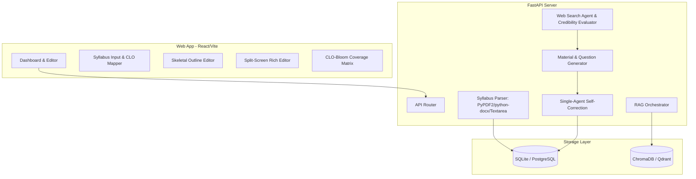

# 📐 THIẾT KẾ CHI TIẾT MVP (MVP TECHNICAL DESIGN)
## DỰ ÁN: AI TRỢ LÝ THIẾT KẾ BÀI GIẢNG & HỌC LIỆU (AI LECTURE ASSISTANT)

> **Mã đề tài:** AI20K-005  
> **Phiên bản:** MVP 6 tuần (6-Week Tinh gọn)  
> **Đối tượng sử dụng:** Giảng viên Đại học (Higher Education)

---

## 1. PHẠM VI MVP & THÀNH PHẦN KIẾN TRÚC

Kiến trúc MVP được rút gọn tối đa nhằm tập trung vào việc giải quyết 3 pain points lớn nhất: **Giấy tờ thủ tục kiểm định (Bloom & CLO)**, **AI ảo tưởng (Hallucination)**, và **Tối ưu thời gian soạn bài giảng/đề thi**.



### Các Tính năng trong Phạm vi MVP (In-Scope)
1. **Syllabus Ingestion & CLO Mapper:** Cho phép giảng viên tải Syllabus (PDF/Docx) hoặc dán text trực tiếp. LLM bóc tách các chuẩn đầu ra (CLO) kèm theo cơ chế nhập tay/chỉnh sửa để tránh lỗi parser.
2. **Strict Multi-tenant RAG:** Lưu trữ tài liệu nguồn giáo trình/slide của môn học, phân tách dữ liệu tuyệt đối giữa các tài khoản giảng viên bằng metadata filtering.
3. **Skeletal Outline Design:** Sinh dàn ý chương trình giảng dạy, cho phép kéo thả/sửa đổi thủ công trước khi sinh chi tiết.
4. **Split-Screen Editor (Human-in-the-loop):** Giao diện chia đôi, bên trái là nội dung Markdown slide/hoạt động Active Learning do AI đề xuất, bên phải là Rich Text Editor để giảng viên duyệt và sửa.
5. **Isomorphic Question & Bloom Tagging:** Sinh bộ câu hỏi trắc nghiệm gán tag CLO và mức Bloom. Hỗ trợ sinh câu hỏi đồng cấu (thay đổi số liệu/ngữ cảnh) chạy qua bộ tự kiểm tra (Self-Correction Step).
6. **Web Search & Credibility Evaluation:** Khi không có tài liệu nguồn, AI sẽ tìm kiếm thông tin từ Internet thông qua các nguồn uy tín và chạy tác nhân đánh giá độ tin cậy để tóm tắt học liệu.

---

## 2. THIẾT KẾ CƠ SỞ DỮ LIỆU TỐI GIẢN (SQLITE SCHEMA)

Để đảm bảo triển khai nhanh chóng trong 6 tuần, SQLite là lựa chọn tối ưu cho môi trường MVP. Dưới đây là Database Schema chi tiết:

```sql
-- Bảng thông tin Giảng viên (Đăng nhập JWT)
CREATE TABLE users (
    id INTEGER PRIMARY KEY AUTOINCREMENT,
    email VARCHAR(255) UNIQUE NOT NULL,
    password_hash VARCHAR(255) NOT NULL,
    full_name VARCHAR(100),
    created_at TIMESTAMP DEFAULT CURRENT_TIMESTAMP
);

-- Bảng thông tin Môn học
CREATE TABLE courses (
    id INTEGER PRIMARY KEY AUTOINCREMENT,
    user_id INTEGER NOT NULL,
    course_code VARCHAR(50) NOT NULL,
    course_name VARCHAR(255) NOT NULL,
    created_at TIMESTAMP DEFAULT CURRENT_TIMESTAMP,
    FOREIGN KEY (user_id) REFERENCES users(id) ON DELETE CASCADE
);

-- Bảng các Chuẩn đầu ra (CLO) bóc tách từ Syllabus
CREATE TABLE clos (
    id INTEGER PRIMARY KEY AUTOINCREMENT,
    course_id INTEGER NOT NULL,
    clo_code VARCHAR(20) NOT NULL, -- Ví dụ: CLO1, CLO2
    description TEXT NOT NULL,
    bloom_level INTEGER NOT NULL, -- Từ 1 đến 6 tương ứng Nhớ -> Sáng tạo
    FOREIGN KEY (course_id) REFERENCES courses(id) ON DELETE CASCADE
);

-- Bảng Outline Chương học (Skeletal Design)
CREATE TABLE chapters (
    id INTEGER PRIMARY KEY AUTOINCREMENT,
    course_id INTEGER NOT NULL,
    sort_order INTEGER NOT NULL, -- Thứ tự hiển thị chương
    title VARCHAR(255) NOT NULL,
    description TEXT,
    created_at TIMESTAMP DEFAULT CURRENT_TIMESTAMP,
    FOREIGN KEY (course_id) REFERENCES courses(id) ON DELETE CASCADE
);

-- Bảng lưu trữ slide và kịch bản Active Learning đã phê duyệt
CREATE TABLE chapter_materials (
    id INTEGER PRIMARY KEY AUTOINCREMENT,
    chapter_id INTEGER NOT NULL,
    slide_content TEXT, -- Định dạng Markdown thô
    active_learning_script TEXT, -- Nội dung kịch bản giảng dạy tương tác
    updated_at TIMESTAMP DEFAULT CURRENT_TIMESTAMP,
    FOREIGN KEY (chapter_id) REFERENCES chapters(id) ON DELETE CASCADE
);

-- Ngân hàng câu hỏi Bloom gán tag CLO
CREATE TABLE questions (
    id INTEGER PRIMARY KEY AUTOINCREMENT,
    course_id INTEGER NOT NULL,
    chapter_id INTEGER,
    question_text TEXT NOT NULL,
    question_type VARCHAR(20) DEFAULT 'MCQ', -- MCQ hoặc Tự luận/Điền từ
    options_json TEXT, -- JSON lưu danh sách đáp án A, B, C, D (cho MCQ)
    correct_answer VARCHAR(50) NOT NULL,
    bloom_level INTEGER NOT NULL, -- Gán nhãn Bloom
    clo_id INTEGER, -- Liên kết trực tiếp CLO để đo độ phủ
    is_active BOOLEAN DEFAULT TRUE,
    created_at TIMESTAMP DEFAULT CURRENT_TIMESTAMP,
    FOREIGN KEY (course_id) REFERENCES courses(id) ON DELETE CASCADE,
    FOREIGN KEY (chapter_id) REFERENCES chapters(id) ON DELETE SET NULL,
    FOREIGN KEY (clo_id) REFERENCES clos(id) ON DELETE SET NULL
);
```

---

## 3. CƠ CHẾ CÔ LẬP DỮ LIỆU RAG (MULTI-TENANCY RAG)

Để tránh rò rỉ chéo đề thi bí mật hoặc tài liệu môn học giữa các Giảng viên, hệ thống RAG bắt buộc áp dụng **Payload Filtering** ở tầng Vector Database thay vì chỉ lọc ở tầng Logic ứng dụng.

### Sơ đồ quy trình nạp tài liệu và lọc tìm kiếm
```
[Giảng viên A] ---> Tải giáo trình môn A ---> Chunking ---> Gán Metadata: user_id=1, course_id=10
[Giảng viên B] ---> Tải giáo trình môn B ---> Chunking ---> Gán Metadata: user_id=2, course_id=15
                                                                 │
                                                                 ▼
                                                       [Vector DB: ChromaDB]
                                                                 │
[Giảng viên A] ---> Query RAG ---> API Backend ------> DB Search Filter (user_id=1, course_id=10)
                                                       (Ngăn chặn bốc nhầm tài liệu của GV B)
```

### Code Demo Backend (FastAPI + ChromaDB Metadata Filter)
```python
import chromadb
from chromadb.utils import embedding_functions

# Khởi tạo ChromaDB client
chroma_client = chromadb.PersistentClient(path="./data/vector_db")
sentence_transformer_ef = embedding_functions.SentenceTransformerEmbeddingFunction(
    model_name="all-MiniLM-L6-v2"
)

collection = chroma_client.get_or_create_collection(
    name="lecture_materials",
    embedding_function=sentence_transformer_ef
)

# 1. Hàm nạp chunk tài liệu kèm metadata cô lập
def add_document_chunks(chunks: list[str], page_numbers: list[int], user_id: int, course_id: int):
    ids = [f"usr_{user_id}_crs_{course_id}_chunk_{i}" for i in range(len(chunks))]
    metadatas = [
        {
            "user_id": user_id, 
            "course_id": course_id, 
            "page_number": page_numbers[i]
        } 
        for i in range(len(chunks))
    ]
    
    collection.add(
        documents=chunks,
        metadatas=metadatas,
        ids=ids
    )

# 2. Hàm tìm kiếm RAG cô lập tuyệt đối (Strict Multi-tenancy)
def search_rag_isolated(query: str, user_id: int, course_id: int, top_k: int = 4):
    # Áp dụng bộ lọc payload cứng ở tầng Vector DB
    results = collection.query(
        query_texts=[query],
        n_results=top_k,
        where={
            "$and": [
                {"user_id": {"$eq": user_id}},
                {"course_id": {"$eq": course_id}}
            ]
        }
    )
    return results
```

### RAG Fallback Plan (Ứng phó sự cố)
Nếu Vector DB gặp sự cố hoặc file upload không thể phân mảnh (corrupted):
- Hệ thống bắt lỗi `ChromaDBError/ConnectionError`.
- Chuyển sang chế độ **Fallback (General Knowledge)**: LLM sinh câu trả lời bằng kiến thức mặc định.
- Trên giao diện Frontend, hệ thống hiển thị cảnh báo:
  > ⚠️ **Cảnh báo từ hệ thống:** RAG Vector DB tạm thời không khả dụng. Nội dung được sinh từ mô hình ngôn ngữ chung (General Knowledge) và không có nguồn đối chiếu. Vui lòng kiểm tra lại kiến thức.

---

## 4. TÁC NHÂN TÌM KIẾM WEB & ĐÁNH GIÁ ĐỘ UY TÍN (CREDIBILITY EVALUATION AGENT)

Khi giảng viên không upload tài liệu tham khảo nào, hệ thống sẽ tự động tìm kiếm kiến thức trên mạng để xây dựng bài giảng. Để tránh các nguồn tin rác hoặc bài viết thiếu uy tín học thuật, hệ thống sử dụng một Agent chuyên biệt để sàng lọc.

### Kiến trúc Credibility Evaluation Agent
```
[User Query] ──> [Tavily Web Search] ──> [Top 10 URLs]
                                                │
                                                ▼
                                    [Agent Đánh giá Độ uy tín]
                                                │
       ┌────────────────────────┬───────────────┴───────────────┬────────────────────────┐
       ▼                        ▼                               ▼                        ▼
[Nơi xuất bản]            [DOI / ISSN]                    [Sự đồng thuận]            [Thời gian]
Havard/Cambridge/IEEE     Có chỉ số cụ thể                Ý kiến xuất hiện ở          Xuất bản gần
-> Cộng điểm lớn         -> Điểm cộng học thuật          nhiều nguồn uy tín          -> Ưu tiên
                                                │
                                                ▼
                                       [Tính điểm Uy tín]
                                       (Score: 0.0 -> 1.0)
                                                │
                                     ┌──────────┴──────────┐
                                     ▼                     ▼
                                Score >= 0.7          Score < 0.7
                               [Đưa vào RAG]          [Loại bỏ/Noise]
```

### Quy tắc chấm điểm uy tín (Academic Credibility Scoring Rule)
1. **Source Domain & Publisher (50%):** Tên miền chứa `edu`, `gov` hoặc thuộc các nhà xuất bản học thuật uy tín như `ieee.org`, `springer.com`, `sciencedirect.com`, `cambridge.org`, `harvard.edu`, `vinuni.edu.vn` (+50 điểm).
2. **DOI Identification (20%):** Bài viết có chứa mã nhận dạng DOI (Digital Object Identifier) (+20 điểm).
3. **Citation Consensus (15%):** Nội dung tương tự được xác nhận, đồng thuận chéo ở ít nhất 2 trang web học thuật khác nhau (+15 điểm).
4. **Recency (15%):** Năm xuất bản trong vòng 5 năm trở lại đây (+15 điểm). Nếu bài viết đã xuất bản lâu nhưng là học thuyết nền tảng (được trích dẫn nhiều lần), giữ điểm tối thiểu (+10 điểm).

### Code triển khai Mock Evaluator Agent
```python
import re

def parse_and_score_source(metadata: dict) -> float:
    score = 0.0
    url = metadata.get("url", "").lower()
    content = metadata.get("content", "").lower()
    
    # 1. Đánh giá nơi xuất bản (Publisher / Domain)
    high_academic_domains = ["ieee.org", "springer.com", "sciencedirect.com", "cambridge.org", "harvard.edu", "vinuni.edu.vn", "mit.edu", "nature.com"]
    general_academic_domains = [".edu", ".gov", ".org"]
    
    if any(domain in url for domain in high_academic_domains):
        score += 0.50
    elif any(domain in url for domain in general_academic_domains):
        score += 0.30
        
    # 2. Đánh giá DOI
    doi_pattern = r"\b10\.\d{4,9}/[-._;()/:A-Z0-9]+\b"
    if re.search(doi_pattern, content, re.IGNORECASE) or "doi.org" in url:
        score += 0.20
        
    # 3. Đánh giá sự đồng thuận (Consensus) & độ tin cậy từ khóa học thuật
    academic_keywords = ["peer-reviewed", "journal", "proceedings", "clinical trial", "consensual", "systematic review"]
    if any(keyword in content for keyword in academic_keywords):
        score += 0.15
        
    # 4. Đánh giá thời gian (Recency)
    # Lọc năm xuất bản (ví dụ tìm các năm từ 2018-2026)
    year_match = re.search(r"\b(201[8-9]|202[0-6])\b", content)
    if year_match:
        score += 0.15
    else:
        score += 0.05 # Điểm tối thiểu cho các công trình cũ nền tảng
        
    return score
```

---

## 5. SINGLE-AGENT SELF-CORRECTION PIPELINE (SINH CÂU HỎI ĐỒNG CẤU)

Để sinh câu hỏi đồng cấu (Isomorphic) chất lượng cao, không bị lỗi logic toán học/lập trình và đảm bảo bám sát thang đo Bloom đã chọn, hệ thống chạy quy trình sinh câu hỏi qua **2 pha tự kiểm sửa đổi** trên cùng một mô hình.

```
[Câu hỏi gốc] ──> [Pha 1: LLM Generator] ──> [Câu hỏi mới & Đáp án nháp]
                                                     │
                                                     ▼
                                          [Pha 2: LLM Solver]
                                    (Giải độc lập không xem đáp án gốc)
                                                     │
                                                     ▼
                                            [So sánh kết quả]
                                                     │
                                       ┌─────────────┴─────────────┐
                                       ▼                           ▼
                                Kết quả khớp                 Kết quả lệch
                               [Phê duyệt &               [Kích hoạt Sửa lỗi]
                                Hiện trên UI]           LLM tự điều chỉnh số liệu/
                                                          logic và sinh lại
```

### Prompt Pha 1 (Sinh câu hỏi đồng cấu)
```
System: Bạn là chuyên gia sư phạm thiết kế học liệu chuẩn quốc tế. 
Nhiệm vụ: Dựa trên câu hỏi gốc sau đây, hãy sinh một câu hỏi đồng cấu (cùng chuẩn CLO, cùng mức Bloom, cùng độ khó) nhưng thay đổi hoàn toàn số liệu và ngữ cảnh câu chuyện.
Đầu ra bắt buộc định dạng JSON:
{
  "question_text": "...",
  "options": {"A": "...", "B": "...", "C": "...", "D": "..."},
  "correct_answer": "A/B/C/D",
  "reasoning_path": "Các bước suy luận chi tiết để tính ra đáp án đúng..."
}
Câu hỏi gốc: {original_question}
```

### Prompt Pha 2 (Tự giải & Sửa lỗi - Self-Correction)
```
System: Bạn là một sinh viên xuất sắc đang làm đề thi. Hãy giải câu hỏi trắc nghiệm dưới đây và ghi lại đáp án cuối cùng.
Câu hỏi cần giải: {generated_question}
Các lựa chọn: {generated_options}

(Yêu cầu: Không được nhìn vào trường 'correct_answer' của câu hỏi trước đó. Hãy tự suy luận và chọn đáp án đúng).
Sau đó, hãy đối chiếu đáp án bạn vừa giải với đáp án gốc:
- Nếu trùng khớp: Trả về trạng thái "VALID".
- Nếu sai lệch hoặc phát hiện câu hỏi phi lý (ví dụ: số liệu âm, logic mâu thuẫn): Trả về trạng thái "INVALID", kèm theo đề xuất sửa đổi và tự viết lại câu hỏi hoàn chỉnh sửa lỗi.

Đầu ra định dạng JSON:
{
  "status": "VALID / INVALID",
  "my_answer": "A/B/C/D",
  "error_description": "Mô tả lỗi nếu có...",
  "corrected_question": {
      "question_text": "...",
      "options": {"A": "...", "B": "...", "C": "...", "D": "..."},
      "correct_answer": "..."
  }
}
```

---

## 6. MOCKUP GIAO DIỆN PHÙ HỢP TIÊU CHUẨN (UX/UI MOCKUP)

Giao diện MVP được thiết kế theo hướng thực tế, tối giản, và đảm bảo cơ chế **Human-in-the-loop** không gây crash màn hình.

### 6.1. Giao diện Split-Screen Editor (Sinh Slide & Kịch bản Hoạt động)
Giao diện chia đôi màn hình cho phép giảng viên giữ quyền kiểm soát cao nhất (Decider/Reviewer).

```
+---------------------------------------------------------------------------------------+
|  [Trở lý Giảng viên] Môn học: Cấu trúc Dữ liệu & Giải thuật      [Đăng xuất] (GV Nguyễn) |
+---------------------------------------------------------------------------------------+
|  Chương 3: Cây Tìm Kiếm Nhị Phân (BST)                                                |
+---------------------------------------------------------------------------------------+
| BÊN TRÁI: AI ĐỀ XUẤT (Markdown)            | BÊN PHẢI: KHUNG BIÊN TẬP CỦA GIẢNG VIÊN  |
+--------------------------------------------+------------------------------------------+
|  Slide 1: Khái niệm Cây BST                | # Bài giảng Chương 3: BST                |
|  * Cây nhị phân có tính chất sắp thứ tự    |                                          |
|  * Nhánh trái < Gốc; Nhánh phải > Gốc      | Tuyển tập bài học về Cây Tìm Kiếm Nhị    |
|  [Nguồn: Giáo trình BST - Trang 12]       | Phân (BST) dành cho sinh viên năm 2.     |
|                                            |                                          |
|  [Chèn vào Slide >>]                       | [Nội dung đã duyệt sẽ nằm ở đây và giảng |
|  ----------------------------------------  |  viên có thể gõ thêm, sửa xóa tự do]     |
|  Hoạt động Active Learning (5 phút):       |                                          |
|  * Trò chơi vẽ cây BST nhanh trên bảng     |                                          |
|  * Sĩ số: 40 sinh viên -> chia 4 nhóm      |                                          |
|                                            |                                          |
|  [Chèn vào Kịch bản >>]                    |                                          |
+--------------------------------------------+------------------------------------------+
|  [Tình trạng: Sẵn sàng]                     |  [Lưu bản nháp]     [Xuất bản PDF / MD]  |
+---------------------------------------------------------------------------------------+
```

### 6.2. Giao diện Dashboard Phủ Ma trận CLO-Bloom (Khảo thí & Đảm bảo chất lượng)
Bảng hiển thị trực quan tỷ lệ phủ sóng của ngân hàng câu hỏi môn học đối với Đề cương chi tiết (Syllabus) để giảng viên tự tin nộp phòng Đảm bảo chất lượng.

```
+---------------------------------------------------------------------------------------+
|  [Dashboard Kiểm định Đảm bảo Chất lượng]                                            |
+---------------------------------------------------------------------------------------+
|  Tổng số câu hỏi: 25   |  Số CLO đã phủ: 4/5 (80%)  |  Mức Bloom cao nhất: Phân tích  |
+---------------------------------------------------------------------------------------+
|  MA TRẬN ĐỘ PHỦ CÂU HỎI THEO CHUẨN ĐẦU RA MÔN HỌC (CLO vs Bloom)                       |
|                                                                                       |
|  CLO Code   | Nhớ (B1) | Hiểu (B2) | Vận dụng (B3) | Phân tích (B4) | Tổng số câu hỏi |
|  -----------+----------+-----------+---------------+----------------+-----------------|
|  CLO1       |  [██] 2  |  [████] 4 |  [ ] 0        |  [ ] 0         |       6 câu     |
|  CLO2       |  [ ] 0   |  [██] 2   |  [██████] 6   |  [ ] 0         |       8 câu     |
|  CLO3       |  [ ] 0   |  [ ] 0    |  [██] 2       |  [████] 4      |       6 câu     |
|  CLO4       |  [██] 2  |  [██] 2   |  [██] 2       |  [ ] 0         |       5 câu     |
|  CLO5 (Mới) |  [ ] 0   |  [ ] 0    |  [ ] 0        |  [ ] 0         |  ⚠️ 0 câu (Chưa) |
|                                                                                       |
|  [!] Gợi ý hệ thống: CLO5 (Thiết kế hệ thống BST tối ưu) chưa có câu hỏi nào.        |
|  [Bấm vào đây để AI sinh tự động câu hỏi cho CLO5 ở mức Bloom 4]                      |
+---------------------------------------------------------------------------------------+
```

---

## 7. KẾ HOẠCH BÀN GIAO SẢN PHẨM & DEPLOYMENT

### Stack Triển khai (Production Setup)
- **Frontend App:** Deploy trên **Vercel** (kết nối trực tiếp GitHub Repo để tự động CI/CD khi merge code).
- **Backend API (FastAPI):** Deploy trên **Render** (gói free-tier hoặc $7/tháng). Tích hợp CORS bảo mật chỉ chấp nhận request từ domain Frontend trên Vercel.
- **Database:** SQLite (lưu file trực tiếp trên ổ đĩa ảo Render hoặc Render Disk) hoặc PostgreSQL trên Neon DB (gói Free) để tránh mất mát dữ liệu khi container Render restart.
- **Vector DB:** Qdrant (gói Cloud Free Tier, giới hạn 1GB dữ liệu - hoàn toàn đủ cho MVP).

### Biện pháp chống Crash & Rủi ro
1. **API Timeout Recovery:** Mọi request sinh học liệu dài hơn 30s đều được gửi qua cơ chế polling hoặc xử lý bất đồng bộ (giảng viên có thể tắt cửa sổ popup và nhận kết quả sau).
2. **Strict Limit Cost Protection:** Khống chế mỗi tài khoản giảng viên chỉ được lưu tối đa 3 tài liệu nguồn và sinh tối đa 30 câu hỏi/ngày để tránh bị spam phá hoại tài chính API key.
