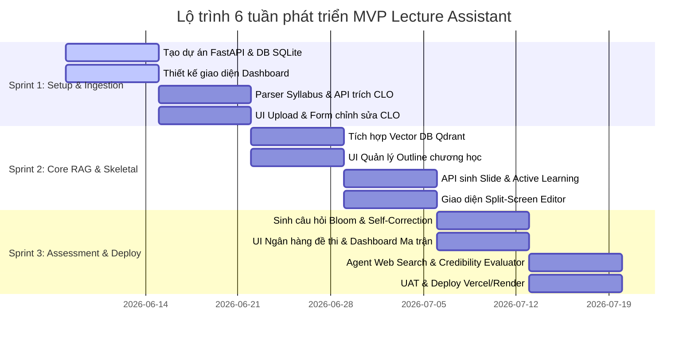

# 🧐 PHẢN BIỆN THIẾT KẾ KỸ THUẬT & KẾ HOẠCH PHÂN CHIA SPRINT
## DỰ ÁN: AI TRỢ LÝ THIẾT KẾ BÀI GIẢNG & HỌC LIỆU (AI LECTURE ASSISTANT)

> **Mã đề tài:** AI20K-005  
> **Phiên bản:** MVP 6 tuần (6-Week Delivery)  
> **Đội ngũ thực hiện:** Nhóm G02 - Team 023 (3 Thành viên)

---

## PHẦN 1: TỰ PHẢN BIỆN THIẾT KẾ & PHƯƠNG ÁN KHẮC PHỤC

Để đưa hệ thống từ ý tưởng ra triển khai thực tế một cách an toàn nhất, dưới đây là phần phản biện thẳng thắn về các lỗ hổng kỹ thuật trong thiết kế MVP hiện tại và phương án phòng vệ (Mitigations).

### 1. Phản biện về việc chọn SQLite làm Database cho môi trường Multi-user
*   **Vấn đề (Critique):** SQLite là cơ sở dữ liệu dạng file đơn giản. Khi triển khai online cho nhiều giảng viên truy cập cùng lúc, SQLite rất dễ gặp lỗi khóa ghi (`database is locked` / `sqlite3.OperationalError: database is locked`) do cơ chế khóa toàn bộ file khi có một tiến trình ghi dữ liệu (Write-Lock).
*   **Hậu quả (Impact):** Khi Giảng viên A đang lưu slide mới, Giảng viên B bấm duyệt câu hỏi thi sẽ bị báo lỗi hệ thống hoặc quay vòng vô hạn, làm crash giao diện.
*   **Giải pháp khắc phục (Mitigation):**
    1.  **Kích hoạt WAL Mode:** Trong FastAPI/SQLAlchemy, khi khởi tạo SQLite connection, cấu hình chạy câu lệnh PRAGMA: `PRAGMA journal_mode=WAL;`. Chế độ Write-Ahead Logging cho phép nhiều tiến trình đọc hoạt động song song ngay cả khi có tiến trình ghi.
    2.  **Đặt Timeout:** Cấu hình tham số `timeout=10` trong chuỗi kết nối SQLite để tự động retry ghi trong tối đa 10 giây trước khi báo lỗi.
    3.  **Lộ trình Nâng cấp:** Sử dụng Neon PostgreSQL (gói Free) ngay từ Tuần 4 khi bắt đầu tích hợp kiểm thử hệ thống thay vì đợi sau 6 tuần.

### 2. Phản biện về luồng Single-Agent Self-Correction cho sinh câu hỏi
*   **Vấn đề (Critique):** Bắt cùng một mô hình LLM vừa sinh câu hỏi (Pha 1) vừa đóng vai học sinh để giải và kiểm tra (Pha 2) dễ mắc lỗi **Confirmation Bias (Thiên kiến xác nhận)**. LLM có xu hướng tự thừa nhận câu trả lời của chính mình là đúng, bỏ qua lỗi logic toán học hoặc lỗi code ẩn bên trong câu hỏi.
*   **Hậu quả (Impact):** Câu hỏi sinh ra bị lỗi tính toán hoặc mâu thuẫn đề bài nhưng AI vẫn báo "VALID" (Hợp lệ) và hiển thị trên màn hình giảng viên.
*   **Giải pháp khắc phục (Mitigation):**
    1.  **Cô lập System Prompt tuyệt đối:** Pha 2 (Solver) phải chạy bằng một System Prompt hoàn toàn khác, được cấu hình tham số `temperature = 0.0` (để đảm bảo tính chính xác và nhất quán tuyệt đối) trong khi Pha 1 (Generator) chạy với `temperature = 0.7`.
    2.  **Ràng buộc cấu trúc Pydantic:** Ép Pha 2 phân tích từng bước tính toán chi tiết (`reasoning_path`) trước khi đưa ra ký tự đáp án cuối cùng.
    3.  **Cross-Model Checking (Nếu chi phí cho phép):** Sử dụng GPT-4o-mini để sinh câu hỏi (Pha 1) và Gemini 1.5 Flash để giải/kiểm tra (Pha 2). Hai mô hình khác nhau sẽ hạn chế tối đa việc lặp lại cùng một lỗi tư duy.

### 3. Phản biện về Web Search & Credibility Evaluator Agent
*   **Vấn đề (Critique):** Thuật toán chấm điểm uy tín nguồn web (`parse_and_score_source`) dựa trên các luật cứng (Rule-based) rất dễ bị qua mặt bởi các trang web tối ưu SEO học thuật giả mạo (Academic SEO Spam), hoặc bỏ sót các nghiên cứu mới/bài báo uy tín chưa có mã DOI hoặc tên miền chưa được cập nhật vào whitelist.
*   **Hậu quả (Impact):** Lọt các thông tin rác từ blog cá nhân vào bài giảng hoặc ngược lại, bỏ sót các tài liệu nghiên cứu cập nhật quý giá của các trường đại học mới nổi.
*   **Giải pháp khắc phục (Mitigation):**
    1.  **Kiểm tra sự đồng thuận (Consensus Check):** Thay vì chỉ đánh giá một nguồn đơn lẻ, Agent sẽ tìm kiếm chéo cụm từ khóa đó ở 3 URL hàng đầu. Nếu nội dung cốt lõi của thông tin đó xuất hiện đồng thời ở nhiều nguồn độc lập, điểm uy tín sẽ được cộng thêm (+0.15).
    2.  **Thông tin minh bạch trên UI:** Hiển thị rõ điểm số uy tín và các tiêu chí đạt được (Ví dụ: "Độ tin cậy: 85% - Nguồn từ IEEE, xuất bản năm 2025") kế bên nội dung slide do AI đề xuất để giảng viên tự đưa ra quyết định duyệt (Human-in-the-loop).

### 4. Phản biện về dung lượng Context Window & Hiện tượng Lost in the Middle
*   **Vấn đề (Critique):** Syllabus và các tài liệu giáo trình tải lên rất dài. Khi dồn quá nhiều văn bản vào Prompt RAG làm ngữ cảnh cho LLM, mô hình dễ bị mất khả năng tuân thủ cấu trúc đầu ra (JSON bị gãy) hoặc bỏ qua các thông tin quan trọng nằm ở giữa ngữ cảnh (Lost in the Middle).
*   **Hậu quả (Impact):** Lỗi gãy API do không parse được định dạng JSON trả về, hoặc AI sinh bài giảng bị thiếu các chương cốt lõi nằm ở giữa tài liệu giáo trình.
*   **Giải pháp khắc phục (Mitigation):**
    1.  **Ứng dụng Reranker:** Sử dụng thư viện rerank gọn nhẹ (như Cohere Rerank API hoặc BGE-Reranker nội bộ) để xếp hạng lại các đoạn chunk sau khi search, chỉ gửi tối đa 3-4 chunk có độ tương quan cao nhất (Top-K thấp nhưng chất lượng).
    2.  **Cấu trúc Prompt tối ưu:** Đặt các chỉ dẫn định dạng JSON và ràng buộc thời gian ở vị trí **cuối cùng** của prompt (vùng LLM chú ý nhất), và đặt dữ liệu RAG ở giữa.
    3.  **MMR (Maximal Marginal Relevance):** Sử dụng thuật toán MMR khi truy vấn Vector DB để đảm bảo các chunk được chọn có nội dung đa dạng nhất, tránh trùng lặp thông tin làm phí không gian context.

---

## PHẦN 2: LỘ TRÌNH THỰC HIỆN MVP 6 TUẦN (SPRINT PLAN)

Nhóm 3 người (Thành viên A - AI/Backend, Thành viên B - Frontend, Thành viên C - QA/DevOps/BA) sẽ thực hiện dự án chia thành **3 Sprints (mỗi Sprint 2 tuần)**:

### 📅 Chi tiết công việc từng Sprint

#### SPRINT 1 (Tuần 1 - Tuần 2): Thiết lập nền tảng & Ingestion Engine
*   **Mục tiêu:** Giảng viên đăng nhập được vào hệ thống, tạo được môn học, tải Syllabus lên và AI trích xuất chính xác các chuẩn đầu ra (CLO) cho phép chỉnh sửa thủ công.
*   **Công việc chi tiết:**
    *   **Backend (Thành viên A):**
        - Khởi tạo FastAPI repo, cài đặt SQLAlchemy kết nối SQLite (WAL mode).
        - Thiết lập luồng Authentication JWT (Đăng ký, đăng nhập).
        - Viết API trích xuất text từ file Syllabus (`pdfplumber` / `python-docx`).
        - Viết prompt LLM bóc tách thông tin Syllabus thành cấu trúc JSON chuẩn (Mã môn, tên môn, danh sách CLO kèm mô tả ngắn và mức Bloom nháp).
    *   **Frontend (Thành viên B):**
        - Tạo dự án React + Vite + Tailwind CSS.
        - Thiết kế giao diện Đăng nhập / Đăng ký.
        - Tạo màn hình Dashboard quản lý danh sách môn học.
        - Thiết kế giao diện upload Syllabus và Form chỉnh sửa CLO (Thêm, sửa, xóa các CLO thô).
    *   **QA / DevOps / BA (Thành viên C):**
        - Thiết lập dự án trên GitHub, phân nhánh branch (`main`, `dev`).
        - Viết tài liệu đặc tả API (Swagger/OpenAPI docs).
        - Soạn bộ dữ liệu Syllabus mẫu (3 môn học khác nhau của VinUni) để làm tài liệu test.
*   **Deliverables cuối Sprint 1:** Hệ thống Đăng nhập hoạt động; Syllabus được upload và trích xuất CLO hiển thị lên UI, cho phép sửa đổi thủ công và lưu vào SQLite.

---

#### SPRINT 2 (Tuần 3 - Tuần 4): Core RAG & Skeletal Design Editor
*   **Mục tiêu:** Nạp tài liệu nguồn môn học vào Vector DB cô lập; sinh outline chương học và xây dựng giao diện soạn thảo Slide/Active Learning chia đôi màn hình (Split-Screen).
*   **Công việc chi tiết:**
    *   **Backend (Thành viên A):**
        - Cài đặt và tích hợp Vector DB Qdrant (Local/Free Cloud).
        - Viết pipeline chunking tài liệu giáo trình (PDF/Txt), nhúng metadata trang (`page_number`), `user_id`, `course_id`.
        - Viết API tìm kiếm RAG cô lập áp dụng Payload Filtering.
        - Viết API sinh dàn ý chương học (Outline) dựa trên CLO và Syllabus.
        - Viết API sinh nội dung Slide (Markdown) và kịch bản Active Learning.
    *   **Frontend (Thành viên B):**
        - Xây dựng giao diện hiển thị dàn ý chương học dạng danh sách cây (Hierarchical list) cho phép thêm/sửa/xóa nhanh.
        - Xây dựng giao diện Split-Screen Editor (Bên trái: Học liệu AI sinh dạng Markdown/Văn bản thô; Bên phải: Rich Text Editor kèm nút "Chèn vào bài giảng").
    *   **QA / DevOps / BA (Thành viên C):**
        - Thiết lập bộ test cô lập dữ liệu (100 câu lệnh test truy vấn chéo tài liệu giữa User 1 và User 2 để đảm bảo không leak dữ liệu).
        - Kiểm thử chất lượng chunking tài liệu giáo trình và trích dẫn số trang thật.
        - Đo lường chi phí API tokens của luồng sinh Slide nháp.
*   **Deliverables cuối Sprint 2:** Outline chương học được tùy biến trên UI; Slide bài giảng và kịch bản tương tác Active Learning được sinh có trích dẫn số trang chính xác của giáo trình và chỉnh sửa được qua giao diện Split-Screen.

---

#### SPRINT 3 (Tuần 5 - Tuần 6): Assessment, Web Agent, Dashboard & Deploy
*   **Mục tiêu:** Sinh câu hỏi trắc nghiệm đồng cấu có self-correction; tích hợp tác nhân Web Search đánh giá uy tín; hiển thị Dashboard ma trận CLO - Bloom; xuất bản file và deploy online hoàn chỉnh.
*   **Công việc chi tiết:**
    *   **Backend (Thành viên A):**
        - Viết prompt sinh câu hỏi trắc nghiệm gán tag Bloom và CLO ID.
        - Viết luồng kiểm thử đáp án tự động Single-Agent Self-Correction (Generator + Solver).
        - Tích hợp công cụ tìm kiếm web (Tavily/Firecrawl) và viết Agent tính điểm uy tín nguồn học thuật (Academic Credibility Score).
        - Viết API tính toán tỷ lệ bao phủ ma trận CLO - Bloom và xuất file Markdown/PDF.
    *   **Frontend (Thành viên B):**
        - Thiết kế UI ngân hàng câu hỏi, nút "Sinh câu hỏi tương tự" (Isomorphic).
        - Xây dựng Dashboard hiển thị tỷ lệ phủ (%) ma trận CLO - Bloom bằng biểu đồ trực quan.
        - Tích hợp tính năng xuất bản slide/đề thi ra file Markdown/PDF.
    *   **QA / DevOps / BA (Thành viên C):**
        - Triển khai Frontend lên Vercel, Backend FastAPI lên Render.
        - Cấu hình PostgreSQL trên Neon DB thay thế cho SQLite ở production.
        - Chạy thử nghiệm toàn hệ thống (UAT - User Acceptance Testing) với 2 giảng viên thực tế để lấy feedback đo lường chỉ số Acceptance Rate.
*   **Deliverables cuối Sprint 3:** Ứng dụng web chạy online hoàn chỉnh (có URL truy cập); ngân hàng câu hỏi đồng cấu được tự sửa lỗi hoạt động tốt; biểu đồ Dashboard đo độ phủ CLO-Bloom hoạt động chính xác; cho phép xuất file PDF/Markdown.

---

## PHẦN 3: MA TRẬN PHÂN CHIA TRÁCH NHIỆM (RACI MATRIX)

Ma trận RACI định rõ vai trò của từng thành viên nhóm đối với các đầu việc cốt lõi của dự án:
- **R (Responsible):** Người trực tiếp thực hiện công việc.
- **A (Accountable):** Người chịu trách nhiệm cao nhất về kết quả công việc (duyệt kết quả).
- **C (Consulted):** Người cung cấp thông tin, tư vấn cho công việc.
- **I (Informed):** Người được thông báo sau khi công việc hoàn thành.

| STT | Hạng mục công việc (Task Item) | Thành viên A (AI / Backend) | Thành viên B (Frontend) | Thành viên C (QA/DevOps/BA) |
|---|---|:---:|:---:|:---:|
| 1 | Thiết kế Kiến trúc & DB Schema | **A** | **C** | **R** |
| 2 | Syllabus Ingestion & Phân tách CLO | **R** | **C** | **A** |
| 3 | Xây dựng Giao diện Dashboard & Form CLO | **I** | **R** | **A** |
| 4 | Cấu hình RAG Cô lập (Metadata Filtering) | **R** | **I** | **A** |
| 5 | Giao diện Split-Screen Editor & Rich Text | **C** | **R** | **A** |
| 6 | Agent Web Search & Đánh giá Độ uy tín | **R** | **I** | **A** |
| 7 | Sinh câu hỏi đồng cấu & Self-Correction | **R** | **C** | **A** |
| 8 | Thiết lập Dashboard Phủ CLO-Bloom | **C** | **R** | **A** |
| 9 | Kiểm thử Bảo mật & Rò rỉ dữ liệu (RAG) | **C** | **I** | **R / A** |
| 10 | Triển khai Hệ thống lên Cloud (Render/Vercel) | **C** | **C** | **R / A** |
